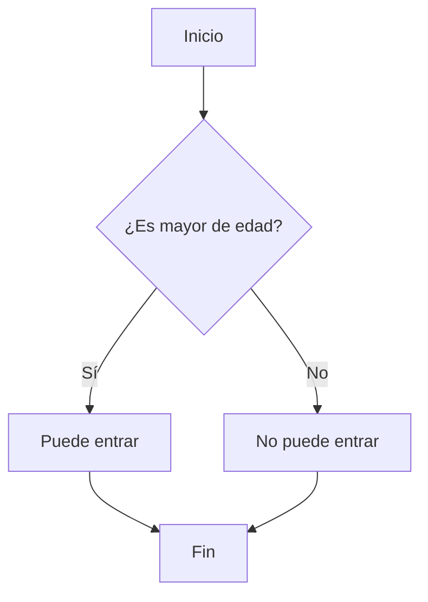

# mark down
Índice
1. [Obj3tivo](#objetivo)
2. [Saberes a reforzar](#saberes-a-reforzar)
3. [introducción](#introducción)
4. [materiales](#materiales)
5. [desarrollo](#desarrollo)


## Objetivo

Aprender los elementos necesarios de mark down para la documentación del software.

## Saberes a reforzar

Herramientas para  la documentación del software.

## Introducción

Markdown es un lenguaje de marcado ligero basado en texto plano, que permite dar formato a texto de manera sencilla y legible, para luego convertirlo a HTML u otros formatos. Fue creado en 2004 por John Gruber y Aaron Swartz con el objetivo de que sea fácil de escribir y fácil de leer incluso en su forma "cruda" (sin procesar).

Puedes pensar en Markdown como una forma de escribir texto con "decoraciones" mínimas que indican cómo debe verse, pero sin la complejidad de HTML u otros lenguajes de marcado más pesados.

Encabezados (títulos)

```markdown
# Título nivel 1
## Título nivel 2
### Título nivel 3
#### Título nivel 4
##### Título nivel 5
###### Título nivel 6
```

Énfasis (negritas y cursivas)

```markdown
*texto en cursiva* o _texto en cursiva_
**texto en negrita** o __texto en negrita__
***texto en negrita y cursiva***
```

Listas
Desordenadas (con viñetas):

```markdown
- Elemento 1
- Elemento 2
- Subelemento 2.1 (con 2 espacios al inicio)
- Subelemento 2.2
- Elemento 3
```

Ordenadas (numeradas):

```markdown
1. Primer paso
2. Segundo paso
3. Tercer paso
```

Enlaces e imágenes
```markdown
[texto del enlace](https://ejemplo.com)


```

Citas

```markdown
> Esto es una cita.
> Puede ocupar varias líneas.
```

Código
En línea (dentro de un párrafo):

```markdown
Usa la función `print()` en Python.
Bloque de código (con o sin resaltado de sintaxis):
```

Ejemplo

```python
def hola():
    print("Hola mundo")
```
Líneas horizontales
```markdown
---
```


Tablas (como las que hemos visto)

```markdown
| Columna 1 | Columna 2 |
|-----------|-----------|
| Dato 1    | Dato 2    |
| Dato 3    | Dato 4    |
```
### poner indice

En Markdown, cada encabezado se convierte automáticamente en un ancla (anchor) que puedes enlazar internamente usando [texto del enlace](#id-del-encabezado).

Cómo se forma el ID del encabezado

Depende del renderizador, pero la mayoría sigue estas reglas:

Se toman las palabras del título.
Se convierten a minúsculas.
Se eliminan signos de puntuación (excepto guiones).
Los espacios se reemplazan por guiones (-).

Por ejemplo, el encabezado ## Mi sección especial generaría el ID #mi-sección-especial (la # es parte del enlace, pero en la URL fragmento se usa solo mi-sección-especial).

Ejemplo práctico:

```markdown
# Mi Documento

## Tabla de Contenidos
- [Introducción](#introducción)
- [Instalación](#instalación)
- [Configuración](#configuración)
- [Opciones avanzadas](#opciones-avanzadas)
- [Conclusión](#conclusión)

## Introducción
Aquí va la introducción...

## Instalación
Pasos para instalar...

## Configuración
Detalles de configuración...

### Opciones avanzadas
Parámetros extra...

## Conclusión
Resumen final...
```


## Formulas con latex

Sintaxis básica para fórmulas en LaTeX dentro de Markdown:

Usa \$...\$ para fórmulas en línea, por ejemplo: 

\$E = mc^2\$ da: $E = mc^2$ 

Usa \$\$...\$\$ para fórmulas centradas en una línea aparte, por ejemplo:


\$\$
\int_{a}^{b} f(x) \, dx
\$\$

da:

$$
\int_{a}^{b} f(x) \, dx
$$

Simbolos

​$\sum$
$\pi$
$\in$
$\infty​$
$\prod$
Suma: $\sum_{i=1}^n → \sum$
Producto: $\prod_{i=1}^n → \prod$
punto: $\cdot$
multiplicacion: $\times$
Fracciones: \frac{numerador}{denominador} → $\frac{a}{b}$
Raíces: $\sqrt{x} → √x, \sqrt[n]{x} → \sqrt[n]x$
Superíndices: ^, subíndices: _
con llaves {} para agrupar: $x^{2n}_i$

**Símbolos y letras griegas:**

Letras griegas: 
$\alpha, \beta, \gamma, \pi, \Sigma, \Omega, etc.$
Relacionales: $\leq, \geq, \neq, \approx, \equiv$
Operadores: $\pm, \div, \mid, \in, \subset, \cup, \cap$

**Sistemas de ecuaciones**
\[
\begin{cases}
2x + y + 2 = 5 \\
x - 3y = -2
\end{cases}
\]

**Alinear verticalmente los simbolos =**
\[
\left\{
\begin{aligned}
2x + y + 2& = 5 \\
x - 3y &= -2
\end{aligned}
\right.
\]

## agregar imagenes

```markdown

```

## mermaid

[tutorial](https://mermaid.js.org/ecosystem/tutorials.html)



## Complemnetos disponibles

1. Markdown All in One
    * Te da atajos para negritas, listas, tablas, genera índice automático...
    * objetivo: hacer todo más rápido, como tener una navaja suiza.
2. Markdownlint
    * Revisa que tu Markdown esté bien escrito (sin errores de formato).
    * objetivo: que tus documentos se vean ordenados y profesionales.
3. **Markdown Preview Enhanced (Yiyi wang)**
    * Mejora la vista previa, puedes exportar a PDF, HTML, incluir diagramas.
    * objetivo: si necesitas ver bonito lo que escribes o compartirlo en otro formato.
4. **Mermaid (por ejemplo Markdown Preview Mermaid Support) (Matt Bierner)**
    * Te permite dibujar diagramas de flujo, secuencias, etc., escribiendo código.
    * objetivo: meter gráficos chulos sin salir del Markdown.
5. Paste Image (por mushan)
    * Copias una imagen al portapapeles
    * Pegas la imagen (con Ctrl+V) y se guarda sola en tu carpeta.
    * Objetivo: olvidarte de andar copiando archivos y rutas.

Que complementos instalar

* Para apuntes rápidos o documentación sencilla:
    * Markdown All in One + Markdownlint → escribes rápido y sin errores.
* Para exportar a PDF/HTML:
    * Añade Markdown Preview Enhanced → con eso imprimes o compartes como quieras.
* Para meter diagramas:
    * Agrega el de Mermaid → dibujas con texto.

## materiales
* lap top
* software
* curl
* consola bash
* consola cmd

## Desarrollo

Escriba una narrativa para un sistema de gestión de datos usando mark down.
